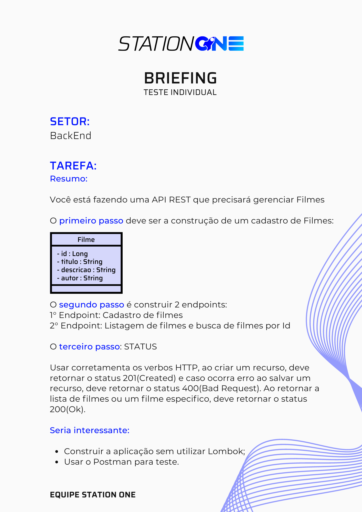

# API - REST para :rocket: StationOne 

## Filmes :computer:

## Desafio

<center>

</center>

## Solução

- [ ] Construção do Banco de Dados MySQL
- [ ] Criação da tabela filmes

```javascript
create table filmes (
    id int not null, 
    nome varchar(50), 
    autor varchar(50), 
    descricao varchar(200)

    primary key(id);
    );
```

- [ ] Utilização de fluxo de trabalho: [git flow](https://www.atlassian.com/br/git/tutorials/comparing-workflows/gitflow-workflow)
- [ ] Instalação das libs:
  - [ ] [express](http://expressjs.com/pt-br/)
  - [ ] [nodemon](https://nodemon.io/)
  - [ ] [ORM sequelize](https://sequelize.org/)
- [ ] Collections no *POSTMAN* e *Thunder Client* para testar o funcionamento das requisições e resostas de status code
- [ ] Documentação via [Swagger](https://swagger.io/)

### Projeto Finalizado
